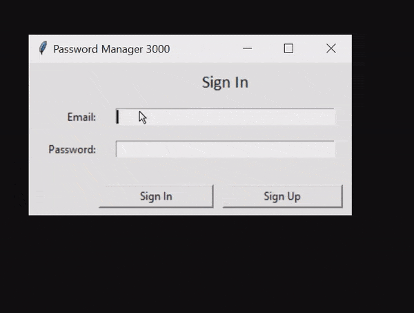

# PasswordManager3000
A personal password manager app created using Python

## Introduction
"Why pay for a password manager when you can make one yourself?" was what I thought to myself before I started work on this app. I wanted a "practical" reason to practice Python and dip my toes into creating a GUI.

PasswordManager3000 stores all your encrypted passwords on a local SQLite database on your machine. More details on how it works exactly with a demo in [Features](#features) below.

## Technologies
Project is created with:
* Python 3.9.1

## Features
### What can PasswordManager3000 do?
* Log into app with a master password

* Add login info for personal accounts (apps/websites)

* Retrieve login info for saved accounts

* List all accounts stored for logged in user

* Delete account info from database

### How does PasswordManager3000 do it?
* The master password is hashed and stored when user signs up; master password itself is not stored so cannot be stolen (as far as I'm aware)

* Each user has a unique user ID used to store accounts in the database; app supports multiple users with unique login emails

* Account passwords are encrypted; key is generated from the master password using PBKDF2HMAC function and Fernet encryption

* All this is delivered using a Python's Tkinter GUI

### Limitations/Warnings
* Stored passwords cannot be decrypted without master password; **however**, information *can* be deleted (no protection from using SQLite queries to edit/delete entries via SQLite browsers or simply deleting the file)

* App does not currently have a feature to generate secure passwords, just store your personally created passwords

* I **would not** consider myself qualified in cryptography by any respectable body (or disrespectable for that matter); use this app ***at your own peril*** if you are comfortable with the level of security provided

## Usage
To use PasswordManager3000, simply clone this repo to your desktop and run PasswordManager3000.pyw. The SQLite database file will be created in the same location as the .pyw file.

## To-Do
* Add a function to generate secure, complex passwords

* Add a timeout feature so that user is automatically signed out of app if left unattended

## Acknowledgements
Special thanks to the good people at [pyca/cryptography](https://cryptography.io/en/latest/) for their cryptography package without which this app would not exist.

## License
I made this for fun (although I may end up using it myself). If you want to use this code, modify it, basically do whatever you want: feel free.

If you *do* use it, find any bugs, have any improvement ideas, etc. let me know (again, if you want; not a legal requirement).

Refer to above [Limitations/Warnings](#limitationswarnings) for more on usage risks.